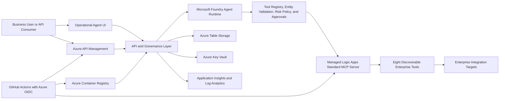

# Architecture

This project uses a Foundry-first architecture for agent planning and
governance, while keeping Azure Logic Apps MCP tools as the mandatory path to
enterprise systems.

## Implemented Architecture

## Platform Responsibilities

| Layer | Responsibility |
|---|---|
| Operational UI and API consumers | Submit integration requests, review approvals, and inspect audit evidence. |
| Azure API Management | Protect and throttle the curated enterprise API surface. |
| API and governance layer | Orchestrate conversations, validate plans, apply policy, and preserve correlation IDs. |
| Microsoft Foundry | Agent planning, model runtime, traces, evaluations, and governance operations. |
| Managed Logic Apps MCP server | Discover and execute approved enterprise workflows as MCP tools. |
| Azure Table Storage | Persist audit events, approval requests, and decisions. |
| Key Vault and managed identity | Protect MCP credentials and eliminate runtime client secrets. |
| Application Insights and Log Analytics | Capture governed telemetry and operational evidence. |
| GitHub Actions and ACR | Validate, release immutable images, smoke test, and roll back. |

## Design Rules

- Foundry is the first-class agent planning, evaluation, and governance platform.
- MCP is the mandatory enterprise execution layer.
- The agent does not call backend systems directly.
- Required entities and risk classification are evaluated before execution.
- High-risk tools require a recorded human approval.
- Every request carries a correlation ID across planning, execution, approvals,
  audit records, and telemetry.
- Normal application releases reuse existing RBAC; privileged provisioning is a
  separate operation.

## Planned Target Architecture

The broader target architecture additionally includes Microsoft Entra browser
authentication, APIM managed identity, private networking, API Center, a
dedicated MCP gateway, continuous evaluations, alerting, and separate
development, QA, UAT, and production environments. These are intentionally
deferred and are not required to demonstrate the completed modernization
pattern.
